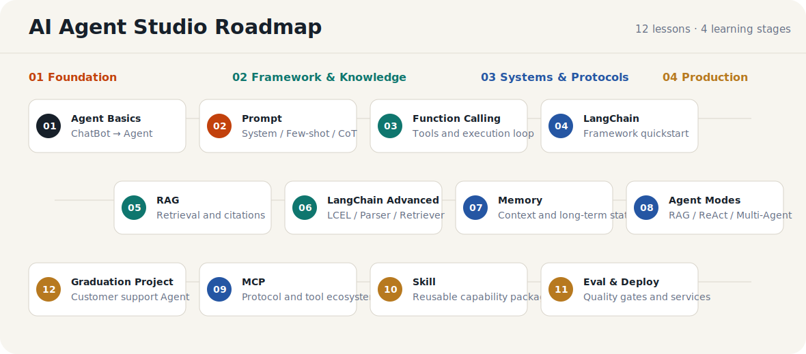
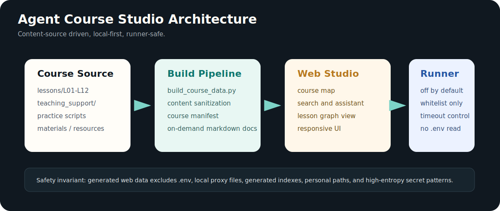
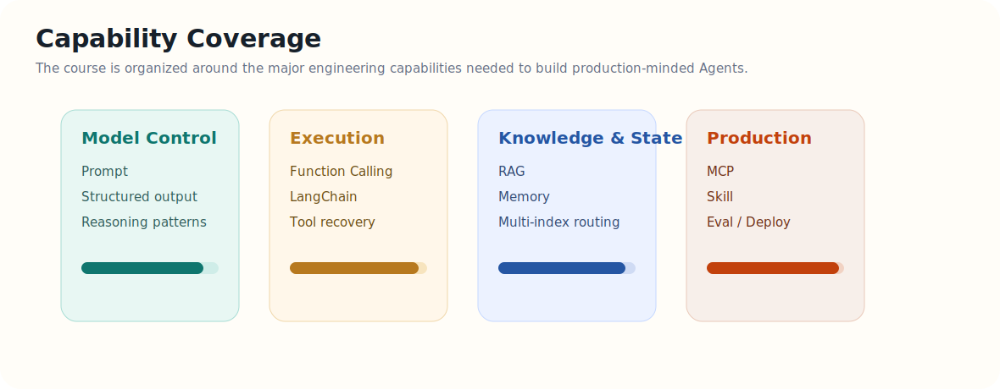

# Agent Course 2026

面向 **AI Agent 开发学习、工程实践、面试准备和毕业项目展示** 的完整课程工作区。仓库覆盖从 Agent 基础认知、Prompt、Function Calling、LangChain、RAG、Memory、MCP、Skill，到评测部署和智能客服毕业项目的完整路径，并配套一个可运行的网页版课程实验室。




## What This Repo Contains

| 模块 | 内容 |
| --- | --- |
| `lessons/L01-L12` | 12 章课程材料：讲义、总结、课前清单、小测、拓展作业、面试题、实践代码 |
| `apps/agent_course_studio` | 网页版 Agent 开发课程实验室 |
| `teaching_support` | 教辅资料：BM25、Agent 设计模式、常见设计模式、AI Native 工作方式、外部学习资源 |
| `requirements` | 按主题拆分的依赖文件 |
| `scripts` | 环境激活、依赖安装、模型连通性检查 |
| `WEB_COURSE_PRODUCT_PLAN.md` | 网页课程实验室产品计划和实施路线 |

## Agent Course Studio

`Agent Course Studio` 是本仓库的可视化学习入口。它不是普通文档站，而是一个本地优先的课程工作台：

- 12 章课程路径导航。
- 讲义、实战、面试、资源统一展示。
- 本地搜索和引用式课程助手。
- 每章 Agent 开发图谱。
- 浏览器本地学习进度记录。
- 白名单实验运行接口，默认关闭真实执行。



### Start The Studio

```bash
cd <course-root>
python3 apps/agent_course_studio/build_course_data.py
python3 apps/agent_course_studio/server.py --host 127.0.0.1 --port 8765
```

打开：

```text
http://127.0.0.1:8765
```

如果你在远程服务器或 VS Code Remote 中运行，请转发 `8765` 端口。

## Course Map

| 阶段 | 章节 | 主题 |
| --- | --- | --- |
| Foundation | L01-L03 | Agent 全景认知、Prompt Engineering、Function Calling |
| Framework & Knowledge | L04-L06 | LangChain 快速上手、RAG、LangChain 深入实践 |
| Systems & Protocols | L07-L09 | Memory、Agent 模式、MCP 工具生态 |
| Production | L10-L12 | Skill、评测部署、智能客服毕业项目 |



## Lesson Structure

每一章保持稳定结构，方便上课、自学和网页生成：

```text
lessons/Lxx_xxx/
  README.md
  lecture/
    LECTURE_FULL.md
    CHAPTER_SUMMARY.md
  materials/
    PRECLASS_CHECKLIST.md
    NOTES_TEMPLATE.md
    MINI_QUIZ.md
    EXTENSIONS.md
    INTERVIEW_QA.md
  practice/
    *.py
    preclass_run.sh
  resources/
    *.md
```

## Quick Start

所有课程依赖统一安装在 `agent_course` conda 环境中。不要在系统 Python、其他项目环境或临时虚拟环境里安装本课程依赖。

文档中的 `<course-root>` 指你 clone 后的本仓库根目录，`<conda-root>` 指本机 Miniconda/Anaconda 安装目录。

### 1. Activate Environment

```bash
source <conda-root>/etc/profile.d/conda.sh
conda activate agent_course
```

或使用课程脚本：

```bash
source <course-root>/scripts/activate_course.sh
```

### 2. Install Dependencies

```bash
pip install -r requirements/core.txt
pip install -r requirements/langchain.txt
pip install -r requirements/rag.txt
pip install -r requirements/mcp.txt
pip install -r requirements/deployment.txt
```

### 3. Prepare Environment Variables

```bash
cp .env.example .env
# Fill in your own API keys and model settings.
```

### 4. Run Checks

```bash
python scripts/check_env.py
python scripts/smoke_openai.py
```

## Run A Lesson

以 L05 RAG 为例：

```bash
source <course-root>/scripts/activate_course.sh
cd <course-root>/lessons/L05_rag
bash practice/preclass_run.sh
```

每章的 `README.md` 都包含本章学习路径、实践命令和交付物。

## Graduation Project

L12 是端到端毕业项目：**智能客服 Agent**。

它覆盖：

- LangGraph 状态机。
- RAG 知识库。
- 多轮澄清。
- 投诉工单。
- 人工兜底。
- FastAPI 服务。
- 测试和评测脚本。
- 前端客服台和运营 Dashboard。

入口：

```text
lessons/L12_graduation_project/
```

## Safety Notes

- 密钥只放在 `.env` 中，仓库只保留 `.env.example`。
- `use_proxy.sh`、`unset_proxy.sh`、生成索引和运行态缓存不进入 Git。
- 网页实验运行默认关闭，开启后也只运行课程白名单脚本。
- 课程代码应包含必要教学注释，关键模块遵循 `CODE_COMMENTING_GUIDE.md`。

## Maintainer Workflow

课程内容更新后，重新生成 Studio 数据：

```bash
python3 apps/agent_course_studio/build_course_data.py
```

提交前建议运行：

```bash
python3 -m py_compile apps/agent_course_studio/build_course_data.py apps/agent_course_studio/server.py
node --check apps/agent_course_studio/web/app.js
git diff --check
```
